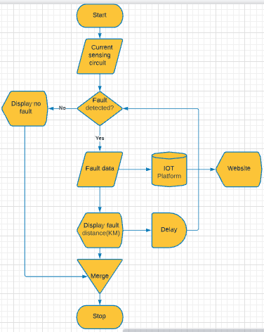

# IOT_UNDERGROUND-FAULT-LOCATION-AND-DETECTION
<Final Year Project 2021>


# Abstract
Fault in power systems is one of the greatest problems that cause power disruptions. It can occur from generation, distribution, and consumer systems. This project will focus mainly on the underground line fault.Underground cables are used more often in urban areas than overhead lines. It is difficult to locate a fault when it occurs, and the process may be time-consuming and costly. The proposed system will find the exact location of the fault and facilitate timely maintenance. The concept of a potential divider network connected across the underground line will be used.
IoT will allow the authority to check faults over the internet while in their respective stations. Therefore, they can alert the technicians who are near the particular location for repair.
A set of resistors represents the length of the cable in kilometres, and faults are created at predefined distances using switches. In case of a fault, there will be a change in current drops, which will be sent to the microcontroller. The ADC in the microcontroller interprets the data and conveys the information to the user in terms of distance in kilometres. This is then displayed over the LCD and shared online using the IoT platform.

# Acknowledgement
I wish to express my sincere gratitude to Kenyatta University for providing me with the training opportunity to fulfil my dream of becoming an Electrical Engineer. More so, providing the necessary infrastructure and services to develop my engineering skills and expertise. My special thanks to my supervisor Eng. Kore for his guidance, assistance, and effort to enable the success of this project. I would also want to acknowledge my classmates for their various assistance during various research and analysis, finally, to the Almighty God for offering His grace throughout this journey.

# System Overview

The system overview is shown below


# Flow Chart

It is shown below



# System Components

1. Arduino Uno [Arduino Rev3](https://store-usa.arduino.cc/products/arduino-uno-rev3/)
2. Current sensing circuit-Combination of resistors and switches
3. 1kilo ohm resistor
4. Push button[Component](https://components101.com/switches/push-button)
5. Esp32(Wemos Lolin32)[Component](https://artofcircuits.com/product/lolin32-esp32-dual-core-wifibluetooth-development-board-with-battery-charger)
6. Relays [Component](https://elearn.ellak.gr/mod/book/view.php?id=4568&chapterid=2440)

# Schematic Diagram


# Simulation

# Firmware and Code

## Libraries

SoftwareSerial.h,LiquidCrystal.h were included on the atmega328p code

```
#include <SoftwareSerial.h> //library for the serial ports
#include <LiquidCrystal.h> //library for the LCD display
SoftwareSerial mySerial(0,1); //defining the serial communication ports

#include <WiFi.h> //include the wifi dependancies
#include <ThingSpeak.h> //include the thingSpeak dependancies
#include <String.h>//library for formating string
```
## Variables and Constants

```
int sensorPin   = A0; // select the input pin for ldr
int sensorValue = 0; // variable to store the value coming from the sensor
```
## Setup fuction for arduino uno
```
void setup() {

  pinMode(8, OUTPUT);//initialize as output for red phase
  digitalWrite(8, LOW);//turn off the relay
  analogWrite(6, Contrast); //specifying the LCD contrast

  Serial.begin(9600); //sets serial port for communication
  mySerial.begin(115200);
  lcd.begin(16, 2);
  lcd.clear(); //clear LCD screen
  lcd.print("UNDERGROUND CABLE");
  lcd.setCursor(0, 1); //setting the cursor position
  lcd.print("FAULT LOCATOR");
  delay(2000);
}
```
## Loop function to check the fault
```
void loop()//start of the execution process
{
  lcd.clear();
  digitalWrite(8, HIGH);
  delay(3000);

  sensorValue = analogRead(sensorPin); // read the value from the sensor
 // Serial.println(sensorValue);
  voltage=sensorValue*(5.0/1023.0);
  //dtostrf(val, 4, 6, buff);      //convert float to a string 
  Serial.println(voltage); //prints the line voltage from the sensor.
  
  if ( (sensorValue >= 1000) ) //5.0V
  {
    lcd.setCursor(0, 0);
    lcd.print("R -  NF,        ") ;
    Serial.println("R -  NF   ") ;

  }

  else if ( (sensorValue >= 890) && (sensorValue <= 920)  ) //4.44V
  {
    Serial.println("R - 2KM,") ;
    lcd.setCursor(0, 0);
    lcd.print("R - 2KM      ") ;
  }
  else if ( (sensorValue >= 870) && (sensorValue <= 880)  ) //4.29V
  {
    Serial.print("R - 4KM,") ;
    lcd.setCursor(0, 0);
    lcd.print("R - 4KM       ") ;
  }
  else if ( (sensorValue >= 800) && (sensorValue <= 825)  ) //4.0V
  {
    Serial.println("R - 6KM,") ;
    lcd.setCursor(0, 0);
    lcd.print("R - 6KM      ") ;
  }
  else if ( (sensorValue >= 670) && (sensorValue <= 688)  ) //3.33V
  {
    Serial.println("R - 8KM,") ;
    lcd.setCursor(0, 0);
    lcd.print("R - 8KM      ") ;// print fault at 8 kilometres
  }
  delay(2000);
  digitalWrite(8, LOW);
  delay(1000);
  lcd.clear();
  delay(1000);
  
}
```
* WiFi Setting
I initialised the credentials for my wifi connection
```
const char* ssid = "FesTech-07905507";
const char* password = "ikings001*";
```
* Function and constants for ESP32
```
//defining the ThingSpeak channel id and api key
#define channel_id 111111
#define channel_key "xxxxxxxdx"
const int Field_Number_1 = 1;

WiFiClient client;//initializing wifi client

#define TXD2 17 //definition of tx and rx
#define RXD2 16
String volt;
void initWiFi()  //function to initialise wifi
{      
  WiFi.mode(WIFI_STA); //setting wifi to station mode
  WiFi.begin(ssid, password);
  Serial.print("Connecting to WiFi ..");
  while (WiFi.status() != WL_CONNECTED) 
  {
    Serial.print('.');
    delay(1000);
  }
  Serial.println("Connected");
  Serial.println(WiFi.localIP());
}

```
* Setup function
```
void setup() 
{
  Serial.begin(115200); //setting the baud rate for serial communication
  Serial2.begin(9600, SERIAL_8N1, RXD2, TXD2); //initialise the serial port
  initWiFi();
  Serial.print("RRSI: ");
  Serial.println(WiFi.RSSI());
  ThingSpeak.begin(client);
}
```
* Loop Function
```
void loop() 
{
  Serial.println("Fault received ");
  volt=Serial2.readString(); //initialising serial string to volt variable
  Serial.println(volt);
  ThingSpeak.writeField(channel_id,1,volt,channel_key); //upload the string to the IOT platform
   delay(15000);
  }
```
